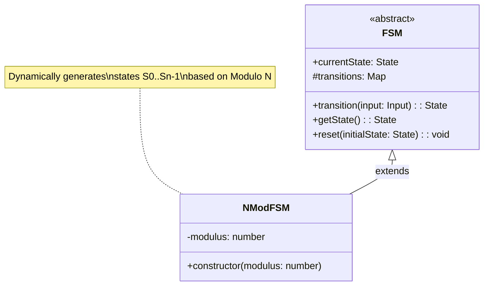
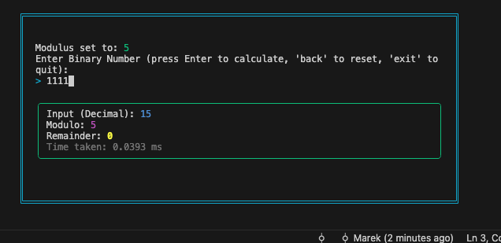

# FSM - Finite State Machine

A versatile TypeScript implementation of a Finite State Machine (FSM), featuring a concrete implementation for Modulo N calculations and an interactive CLI.

## Getting Started

### Prerequisites

- **Node.js**: v20+ (ESM support required)
- **npm**: Bundled with Node.js

### Installation

1. **Clone the repository**:

   ```bash
   git clone https://github.com/marekmgola/fsm.git
   cd fsm
   ```

2. **Install dependencies**:

   ```bash
   npm install
   ```

3. **Build the project**:

   ```bash
   npm run build
   ```

4. **Run the CLI**:
   ```bash
   npm start
   ```

## Global Architecture

The project is built around a robust Object-Oriented architecture designed for extensibility.

### Core Components

- **`FSM<Input>`**: An abstract base class that defines the core logic for any Finite State Machine. It manages the current `State` and handles `transitions` based on generic `Input`.
- **`NModFSM`**: A concrete implementation of `FSM` that calculates the remainder of a binary number modulo `N`. It dynamically generates states `S0` to `Sn-1` and their transition logic upon instantiation.

### Diagram



## CLI Showcase

The project includes an interactive Command Line Interface (CLI) built with `React Ink`. It allows users to define a modulus, input a binary string, and simulate the FSM transitions in real-time.



### Usage

To start the interactive CLI:

```bash
npm run cli
```

**Workflow:**

1.  **Enter Modulus**: key in a positive integer (e.g., `3`) and press Enter.
2.  **Enter Binary**: Type a binary sequence (e.g., `1101`).
3.  **View Result**: The application calculates and displays the remainder (decimal value) and the time taken.
4.  **Controls**: Type `back` to reset the modulus or `exit` to quit.

## Running Tests

We use [Vitest](https://vitest.dev/) for unit testing to ensure the correctness of the FSM logic.

To run the test suite:

```bash
npm test
```

## Pre-commit Hooks

This repository ensures code quality using [Husky](https://typicode.github.io/husky/) pre-commit hooks.

Before every commit, the following checks are automatically executed:

1.  **Linting**: Runs `eslint` to catch code style issues.
2.  **Type Checking**: Runs `tsc --noEmit` to ensure type safety.
3.  **Tests**: Runs `npm test` to verify no regressions were introduced.

If any of these steps fail, the commit will be aborted.
